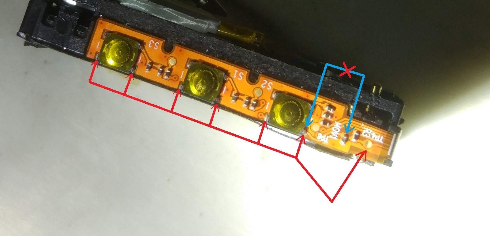
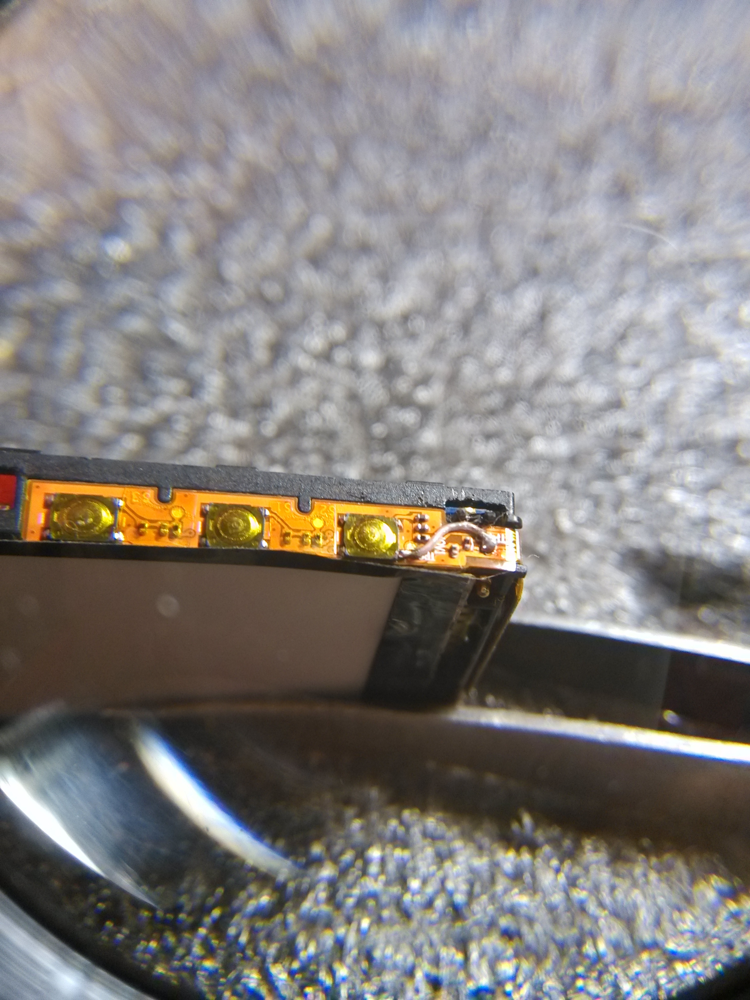

## Problem description
Following info is thanks to user Denis_Amiton from [this Pebble Forums thread](https://forums.pebble.com/t/watch-buttons-not-working/19715/18)
> The problem is in the broken wire.
> All buttons have a common contact on the one side of the watch.
> And I think this contact is the ground contact of the buttons but not the watch.
> In normal state these contacts are connected with a right side of the watch (with the connector) and for example with a small circle on the right.
> When the line is broken buttons stop working.
> If when you press the down button using force the contact in the wire will be restored for a small time and then it will stop working again.
> For a complete repair you'll need need the very small wire and very thin tip on your soldering iron.
> Iif you look at the picture you’ll see how to perform the fix, all the people that tried it reported success so it is a 100% solution.

## Pictures

